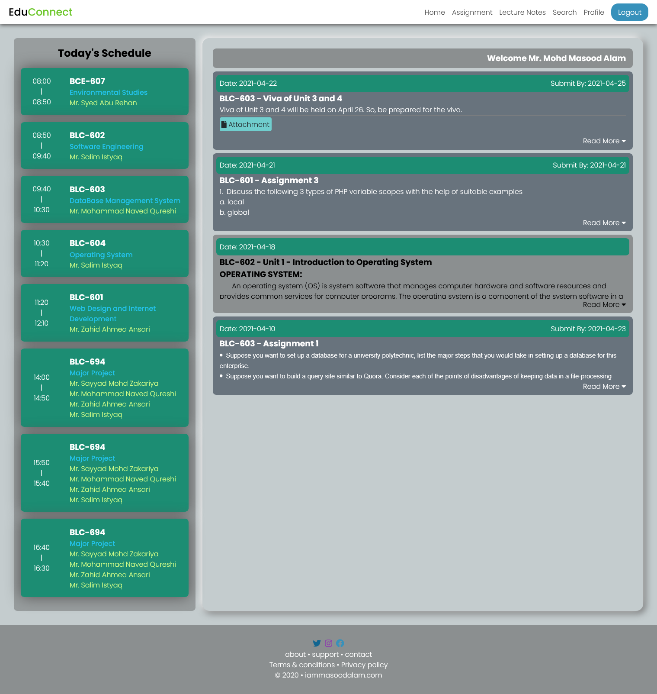

# WebPro
This website is my major project as a student of Diploma in Computer engineering.

## To install this project into your server, follow: 
1. Save this project to your directory.
2. Create a database named **educonnect**
3. Or you can use any empty database and rename the database name in the *includes/connection.inc.php* file.
4. Then import database provided in the *sql* folder.
5. Use id = *12345* and password = *zahid*, in Admin section to create user of your own.

And there you go you have completed the setup.
Now you can run this application by starting your **php** and **MySQL** server.

Homepage of a student will look like this.
